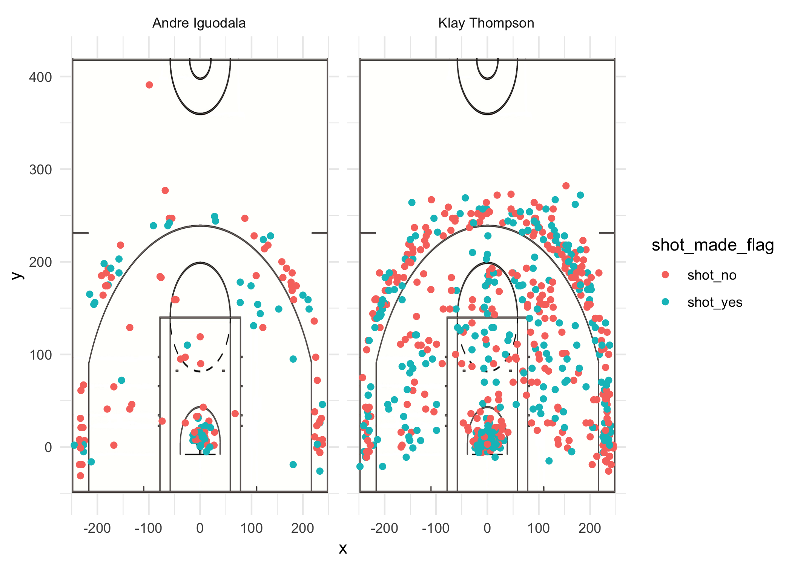
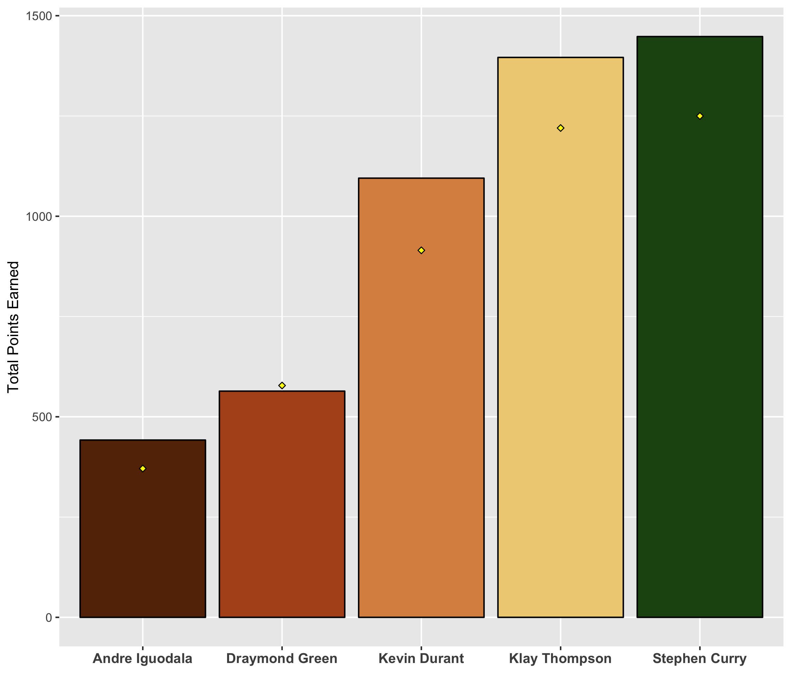
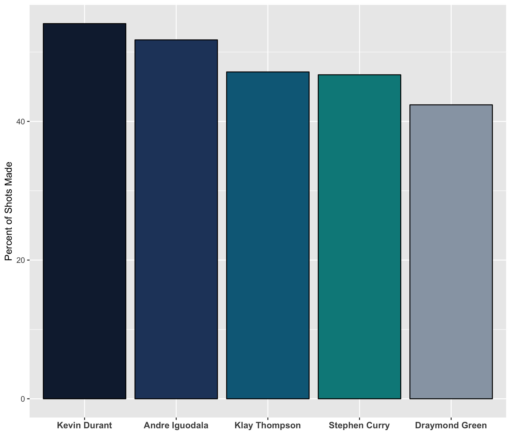

```{r include=FALSE}
setwd("~/Desktop/hw-stat133/workout01/report")
```

##Which Numbers to Look At?

The basketball field is fun but not equal in opportunity. Some players get many chance to shoot a hoop, others none. This makes sense, coach wants his best hoopers shooting so the team can win. But do the hoopers who score the most points succeed because of their higher accuracy or or their higher opportunity? Let's check out at the numbers.

Using shot data from 2016 season of some famous, famous hoopers on the Golden State Warriors team. They are the team that calls the Oakland Bay Area home. Yet despite these are top players, some are more on top. They get paid more, or they have more skill. Even if they are on the same team, players are not equal. Some shoot much more than others. Just compare the shot charts of Mr. Klay Thompson, a "splash" brother, and Mr. Andre Iguodala.

```{r out.width="80%", echo=FALSE, fig.align="center"}
#Imports shot chart image, sets graphic settings

```


Mr. Klay Thompson is shooting many, many hoops compared to Mr. Andre Iguodala. Why is this the case? How much of this is real skill or just chance? Maybe in practice their coach Steve Kerr says no, send the ball to Klay. Coaches have favorites, even in high school sports games. Or maybe their team mates use their own experience to decide who to pass to. They remember oh! in practice, Mr. Klay Thompson is so good. So they pass the ball to him. They make an educated guess that Mr. Klay Thompson, not Mr. Andre Iguodala, will sync the hoop and ball. The fact that Klay has gotten more shots in the past is a self-fulfilling prophecy that he will get passed the ball again and therefore score even more points for his record, while Iguodala is stuck in the background always playing catch up. Or maybe it is Mr. Klay Thompson and Mr. Andre Iguodala themselves! Mr. Iguodala might wait until he feels the moment, while Mr. Thompson doesn't think, just shoots. Whatever the reason, note how much more opportunities some hoopers have than others. 

Do players with more opportunity score as much as the opportunity they are given? It is easy to see that the answer to this question is yes. In the following graph, the pink dot represents the total shots attempted relative to other players, while the bar chart represents the points earned. See how points earned relates to the number of shots they have the opportunity to attempt?
```{r out.width="80%", echo=FALSE, fig.align='center'}
#Imports shot chart image, sets graphic settings

```

However, when you focus on the percent made, or accuracy, the graph tells a different story than the graph on points earned. Mr. Andre Iguodala, who has the second highest accuracy, two percent higher than Mr. Stephen Curry, is also the lowest scorer.
```{r out.width="80%", echo=FALSE, fig.align='center'}
#Imports shot chart image, sets graphic settings

```

Mlle. Catalina Pascualy, a big fan of the Golden State Warriors and the sport of basketball, says “Mr. Stephen Curry, Mr. Kevin Durant, and Mr. Andre Iguodala are the best players.” This is contrary to the data which does not say Mr. Andre Iguodala is the best player. Mlle. Catalina Pascualy has in her head a wholistic view of the basketball field. Our numbers as I have demonstrated them in the graphs throughout this report do not take into their account very many variables or details at all. It is for this reason that our graphs can not by any means demonstrate the full, or even partial story of what is actually happening out there in the real world on the basketball field. 

Different measurements reveal different strengths of players. Mr. Andre Iguodala contributes with defense, not scoring. Mr. Stephen Curry is the top scorer but second lowest in accuracy. He has more shooting opportunities than other players so he can rack in more points. Maybe if opportunity were distributed more equally the stats would be different, but that is for another research team to determine. While this report has focused on shooting and point measures, other skills are valuable on the basketball field. The take home message is that it is our duty as sports fans and data analysts to qualify the information we provide and contextualize where it comes from so as to not mislead our readers or ourselves to any inaccurate or improbable conclusions.


