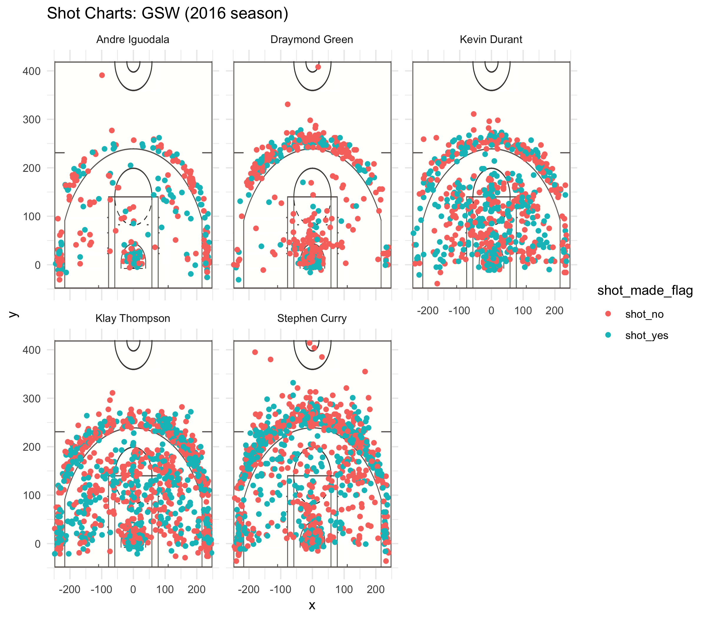

```{r include=FALSE}
setwd("~/Desktop/Stat\ 133/workout01/report")
```

##

The basketball field is fun but not equal in opportunity. Some players get many chance to shoot a hoop, others none. Makes sense, coach wants his best hoopers shooting so he can win. But do the hoopers who score the most succeed because of their higher accuracy or opportunity? Let's look at numbers.

Using shot data from 2016 season of some famous, famous hoopers on the Golden State Warriors team. They are team of Oakland Bay Area. Yet despite these are top players, some are more top. Just compare the shot charts of Klay Thompson, a "splash" brother, and Andre Iguodala.
```{r out.width=80%, echo=FALSE, fig.align='center'}
#Imports shot chart image, sets graphic settings
knitr::include_graphics("../images/andre_klay_charts.png")
```

Mr. Thompson is shooting many, many hoops compared to Mr. Iguodala. Why? Maybe in practice coach says no, send the ball to Klay. Coaches have favorites, even in high school sports games. Or maybe their team mates data mine using their own experience. They remember oh! in practice, Klay is so good. So they pass to him. They make educated guess that Klay, not Andre, will sync the hoop and ball. So they pass to Klay. Or maybe it is Mr. Thompson and Mr. Iguodala themselves! Mr. Iguodala might wait until he feels the moment, while Mr. Thompson doesn't think, just shoots. Whatever the reason, note how much more opportunities some hoopers have than others. 

Do players with more opportunity return the favor? Well, yes. Simple chart.
```{r out.width=80%, echo=FALSE, fig.align='center'}
#Imports shot chart image, sets graphic settings
knitr::include_graphics("../images/points-earned.png")
```

But! Is accuracy considered? 


```{r out.width=80%, echo=FALSE, fig.align='center'}
#Imports shot chart image, sets graphic settings

```


